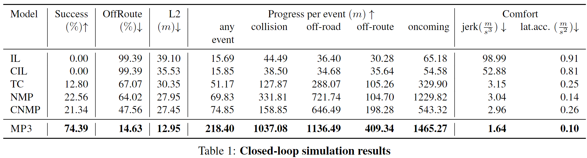

# MP3: A Unified Model to Map, Perceive, Predict and Plan

#### 主要内容

之前的自动驾驶系统大多数依赖于 HD map，但是 HD map 花费较高，依赖高精度的本地设施，而且需要确保 HD map 实时的准确性，否则就会出现如下图的问题：

为了实现一个 mapless（文中指不依赖于 HD map） 的自动驾驶系统，作者提出了一个端到端的系统 **MP3**，该系统接收传感器数据和一个高层的指令（前进、左拐、右拐），以此生成一个中间的在线地图，再根据这个地图做出一个可解释的决策。

实现 mapless 的主要难点在于，缺少 HD map 后， perception 不再仅仅是找到路上的车辆和人行道上的行人（因为没有车道和人行道的范围信息），同样的，motion forecasting 也变得困难了起来，而寻找一个安全的轨迹路径的范围也从一个顺着车道中心线的范围变为了一系列动态轨迹线的集合，并且还需要从高层提供指令，以帮助车辆达到最后的目标。

现有的 mapless 的方法有以下几个缺点：

1. 没有提供一个可解释的中间表示用于解释自动驾驶系统的决定。这不利于发生事故后找到系统相应的原因，也就不利于系统安全性的保证。
2. 部分模型过于简单，只能适应如高速公路之类的简单场景，无法在城市交通等复杂场景应用，稳定性较差。
3. 模型包含信息损失，如对候选道路设置置信阈值等。

#### 实验设计

模型的整体设计如下：

Backbone NetWork 模块主要利用了之前的研究，用于提取场景中的几何、语义和运动信息。

模型中的 Scene Representation 包括了两部分，分别是 Mapping 模块中得到的描述静态信息的 Online map 和 Perception & prediction 模块中得到的描述动态物体信息的 Dynamic state。

- Online Map Representation 包括了车辆可行驶的区域（以路缘划分）、十字路口（该模型不处理红绿灯信息，而是假设有一个子模型可以接收、处理该信息并给出相应指令）、可达道路（在不打破交通规则的情况下可以到达的区域）
- Dynamic State 则表示为了 Dynamic occupancy field，包括两个部分，Initial Occupancy 和 Temporal Motion Feild：

Motion Planning 部分，模型首先生成一个候选的可行路径集合，然后根据一个打分函数对所有的路径进行打分。

- 生成候选路径的方式是：首先有一个已有的专家路线集合，将该集合根据车辆的初始状态（速度、加速度和曲率）对这些路径进行聚类，在进行 online motion planning 时，再根据车辆的当前状态去检索对应的聚类集合。并且不直接应用该路径，而是根据路径和车辆的初始状态，生成相应的加速度和方向盘转角。
- 路径打分函数则考虑了多种因素。首先该函数激励车辆执行高层指令，确保车辆位于目标路径；并且为了使车辆靠近可达道路中央，对于远离道路中央的路径点进行了惩罚；为了确保安全性，对于一条路径中与可能被占用区域重叠的所有点，取最大值作为碰撞代价。

<!--    -->

模型的训练采取了首先训练 online map, dynamic occupancy field, routing 三部分，等到这些部分收敛之后固定其参数，再对 planning 部分进行训练。

#### 实验效果

Closed-loop Simulation Result:

Opened-loop Simulation Result:

model output:

#### 是否开源

未找到相关开源代码
