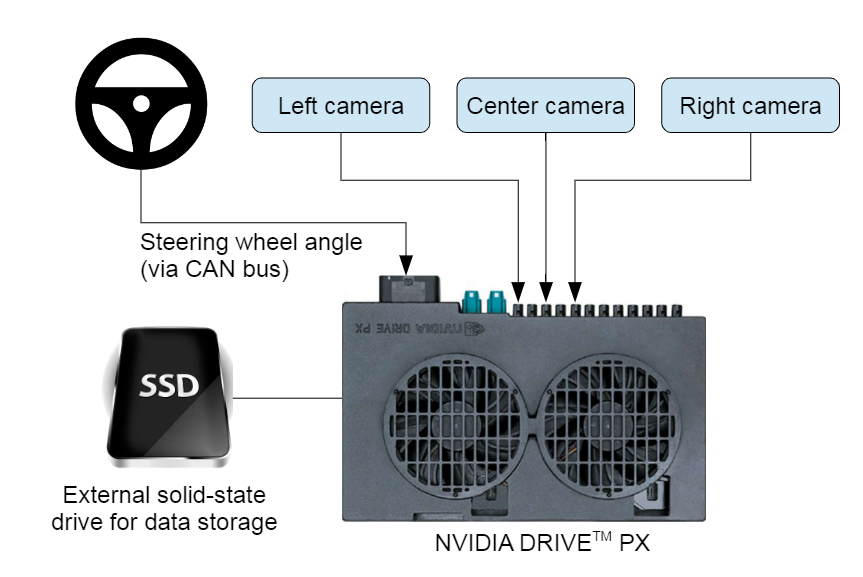
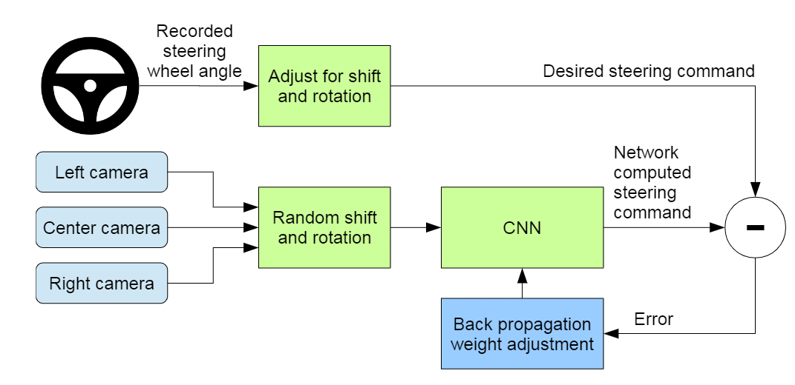
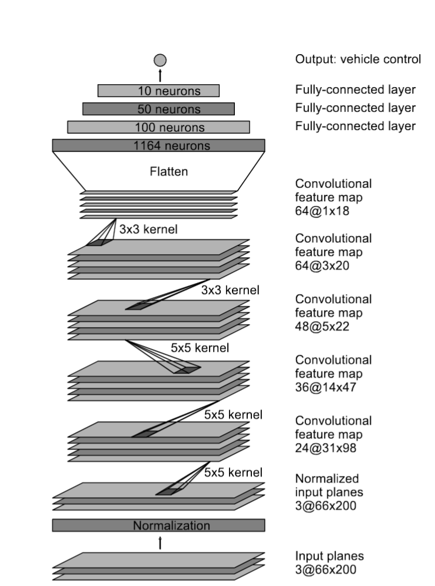
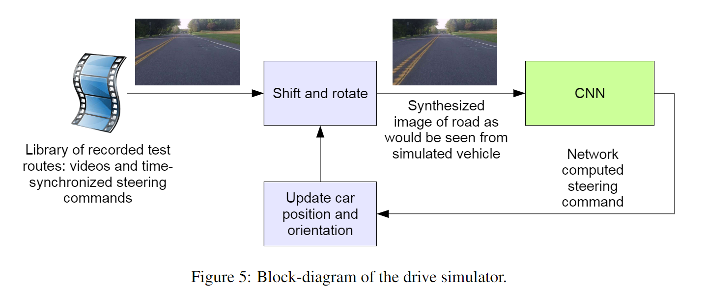
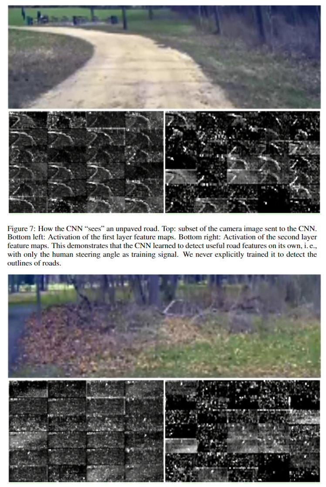

# End to End Learning for Self-Driving Cars

#### 主要内容

训练一个卷积神经网络（ *DAVE-2* ）直接实现端到端的自动驾驶系统。该系统能够适应多种不同的场景。相比较于将各个部分分开设计的的自动驾驶系统。作者认为端到端训练出来的模型应该有着更好的表现和更小的系统，因为内部的组件会自动调整，确保整体的表现最好而不是单个部件表现最好，并且系统会优化用最少的处理步骤去解决问题。

*DAVE-2* 是基于06年研发的 *DAVE* 模型进行构建的，但是 *DAVE* 模型无法适应多种类型场景，并且不够可靠。

该模型还受到1989年的另外一个模型 *Auonomous Land Vehicle in e Neural Network* 的启发，两者的主要区别在于 *ALVINN* 使用的是全连接神经网络，并且受限于当时的算力，模型整体很小，而 *DAVE-2* 使用的是CNN，并且使用了更多的数据去训练出了更大的模型。

#### 实验设计

##### Overview

用于训练模型的数据包括了三个不同方向的摄像头的图片（从录像中截取下来）和对应时刻方向盘转动的角度。

训练过程大致如下：

1. 模型根据三个图片得到一个 proposed steering command
2. 将 proposed steering command 和图片对应的 desired steering command进行对比。
3. 通过 back propagation 调整模型参数使得 proposed steering command 不断接近 desired steering command
4. 多次重复以上步骤得到最终模型
   

##### Network Architecture

神经网络总共包括 9 层
第一层用于标准化输入
第二到第六层的卷积层主要用于提取特征
最后三层的全连接层主要用于控制
但实际上作为一个端到端的系统，特征提取和控制部分的界限是十分模糊的

##### Data Selection

在对录像取样获得图片的过程中使用了较低的取样率（10 FPS），高取样率会导致高重复率，并不会提供更多的有效信息，并且选取的都是沿着道路行驶的图像，丢弃了其余部分。

在以上训练集中，再加入一些额外的训练数据，用于教会模型从偏离道路的位置恢复。

##### Simulator

在进行道路测试之前，作者首先在模拟器上对模型进行了测试。
模拟器具体工作原理如下：
模拟器接收一个记录好的测试录像和与其同步的方向盘指令，然后取第一帧，将其画面进行变换，将视角调整到道路中央，然后把变换后的图像输入到训练好的 CNN 中， CNN 返回一个方向盘指令，模拟器根据该指令对画面进行更新，然后该图像再作为输入提供给 CNN，不断重复。
模拟器会记录下车辆偏离道路中心的距离，车辆的角度和它行驶的距离。当车辆偏离道路中心超过 1 米，就会模拟器终止，并重置汽车的位置和方向到道路中央再继续进行测试。

##### Evaludation

评估分为两步，首先是模拟测试，然后是道路测试

模拟测试中，用于衡量模型的标准是模型能够自动驾驶汽车的时间百分比，每次汽车偏离航道超过一米，就会触发一次终止，每次终止假设占用时间为 6s （包括人类重新控制汽车并把车开回道路中央的时间），以此计算出汽车自动驾驶时间百分比。计算公式如下：

$$
autonomy = (1-\frac{(number \ of \ interventions) · 6 \ seconds}{elapsed \ time [seconds]}) · 100
$$

然后是道路测试，同样使用汽车能够通过系统进行自动驾驶的时间作为衡量标准，但是不包括车道变换和从一条道路转向另一条道路的时间，测试后的自动驾驶时间比例约为 98%。

##### Visualization of Internal CNN State

作者还展示了前两层特征映射层对两个不同的输入图片的处理，一个图片是森林，另一个是一条土路，前两层特征映射层能从土路的图片中将土路的边缘完整的提取出来，而森林提取出来的则几乎全是噪点。作者认为仅靠人类提供的方向盘角度进行训练， *DAVE-2* 已经自己学会了去侦测有效的路径，即使他们从未对这个方面进行单独的训练。

##### Conclusion

作者认为该实验证明了一个 CNNs 就可以学会整个自动驾驶流程，而不需要人为地去切分成各个部分去训练。但同时作者也认为该系统稳定性还是需要进一步提升，并且也需要进一步将网络内部处理过程可视化。

#### 源码及其复现

在github上找到了多个复现代码，我选择了一个使用pytorch进行复现的代码，仓库地址[here](https://github.com/Zhenye-Na/e2e-learning-self-driving-cars)，该代码在训练出模型之后还使用了一个基于unity的模拟器进行模拟测试。但在我在本地尝试测试时可能由于环境或者版本原因无法正常运行。

#### 补充

模型本身较为简单，也没有训练变道、转向、避障等能力，只能作为一个沿着道路中心前行的辅助模块使用。
