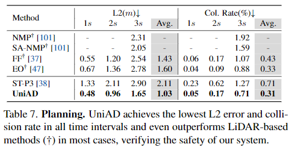

# Planning-oriented Autonomous Driving

#### 主要内容

##### Abstract

现在主流的自动驾驶系统都是设计为线性的任务模块，但这样往往会出现积累性错误或是任务协调能力不足的问题。作者则提出一个良好的框架应该设计用于直接获得最终的结果（自动驾驶的规划），并以此为基础进行修正，也就是说应该是以规划为导向 (planning-oriented) 的。作者根据原先模块化的关键组件中不同部分对于最终结果的贡献给予每个组件了不同的优先级，以此设计了 *Unified Autonomous Driving*（以下简称为 *UniAD*） 。该模型可以利用每个模块的优势，并且从全局上提供了物体间交互的特征抽象，任务间通过和统一的查询接口 (unified query interfaces) 交流，以此促进规划的进行。经过大量的实验测试之后，证实了该理念在各个方面都优于先前的技术。

##### Introduction

主流的模块化的自动驾驶系统为了适应多种场景多种任务，只能通过为多种任务设计独立的模型(a)，或者是设计完成一个多种任务的范式之后为其配备不同的头部(b)来实现。而先前的端到端系统则是只有一个模型(c.1)或者是通过一些模块的线性组合(c.2)来实现自动驾驶系统。*UniAD* 则是以计划为导向，将前面的模块以一定的结构进行组织后进行训练得到模型(c.3)，以此来更好地完成任务。

过去的模型或多或少的没有考虑到一些关键的部分，而在 *UniAD* 中，作者将所有部分都考虑了进去。考虑这些部分的必要性作者在附录部分进行阐述。

*UniAD* 是第一项全面研究自动驾驶领域中包括感知、预测和规划在内的各种任务的联合合作的工作。

该论文的贡献可以概括为以下三点：

1. 证明了高效任务协调的必要性，而非独立设计或只是进行简单的多任务学习。
2. 提出了全面的端到端系统 *UniAD* ，其中关键的组件就是用于连接所有节点的查询设计。
3. 通过在挑战性的基准上实例化 *UniAD* 模型用于现实场景，并经过大量的消融实验后，验证了作者的方法在各方面都优先于先前的技术。

#### 实验设计

##### Methodology

首先多个相机得到的图片队列作为 input 输入到特征提取器中，最终得到的结果被进一步转化为一个鸟瞰图 B (*BEV*)

###### Perception: Tracking and Mapping

1. TrackFormer
   在 *TrackFormer* 中，我们通过从 B 中查询物体的信息来作为可学习的 embeddings (即 Track Q)，以此探测并跟踪物体。最终的结果包含了场景中的物体信息，同时还将车辆周围的物体单独划分为了 Ego-vehicle Query 之后将会用于 Motion Forecast 和 Planning。
2. MapFormer
   *MapFormer* 则将地图查询 (Map Q)作为道路元素（如车道和分隔线）的语义抽象，并对地图进行全景分割。

###### Prediction: Motion Forecast

*MotionFormer* 分别从 TrackFormer 和 MapFormer 中获得高度抽象的动态的物体信息 $Q_A$ 和静态的地图信息 $Q_M$，获得物体和地图之间的互动，并预测出每个物体未来的多条最可能的轨迹，因为物体之间的行为还会相互影响，所以模型对所有考虑的物体进行了联合预测。同时还加入了 Ego-vehicle Query ，以确保自身车辆能够与周围环境、物体互动。

###### Prediction: Occupancy Prediction

*OccFormer* 使用了 B 作为 queries (Occ Q)，以此生成占位栅格图，预测未来多步地图上位置的占用情况。

###### Planning

最后 *Planner* 利用 *MotionFormer* 提供的 Ego-vheicle Query 去预测规划结果，然后保持自身远离 OccFormer 中预测出来的被占用区域以此来避免碰撞。

###### Learning

*UniAD* 的训练分为两个阶段，首先联合训练 perception 的部分，即 tracking 和 mapping 模块，然后再将所有模块进行端到端的训练。

#### 实验效果

##### Joint Result

作者进行了大量的消融实验，通过对比单独一个模块的模型性能以及加入该模块之前的若干模块后的模型性能，证明了整个 pipline 中先前的任务的有效性和必要性。

##### Modular Result

1. Perception result

   
   

   大部分指标均优于过去的模型，但在 Online mapping 部分只有在分段车道上最优。作者认为这是因为 *UniAD* 是用感知到的信息以达到最优的最终规划，而不是调整整个模型去获得最好的感知信息，所以在这一方面会落后于之前哪些具有复杂关联的跟踪检测方法。
2. Prediction result

   

   大部分遥遥领先，少数略微落后
3. Planning result

   

   均优于过去的模型

##### Qualitative Results

模型在现实复杂场景的可视化结果

在附录中作者还展示了更多该模型在复杂场景下的可视化结果，以及面向规划设计的一个有希望的案例，即前面的模块出现不准确的结果，而后面的任务仍然可以恢复，例如，虽然物体有较大的航向角偏差，或者在跟踪结果中未能检测到，但规划的轨迹仍然是合理的。

此外，作者通过分析发现，UniAD 的失败案例主要发生在大型卡车和拖车等长尾场景下，这一点也在附录中有所显示。

##### Ablation Study

- Ablation for designs in the occupancy prediction module.

- Ablation for designs in the planning module.

#### 是否开源以及能否复现

开源，还未进行尝试复现
