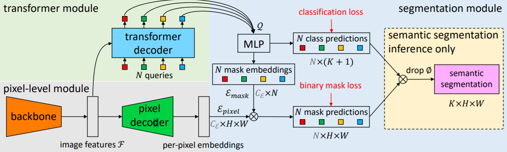

# Introduction
尽管**语义分割**（semantic segmentation）往往借助**逐像素分类**（per-pixel classification）方法来实现，**掩码分类**（mask
classification）方法只被用于实现**实例分割**（instance-level segmentation），本文作者认为掩码分类方法也能用于解决语义分割问题，甚至效果更好。
作者提出了**MaskFormer**模型，该模型会预测一组二进制掩码，每个掩码会与一个类标签关联起来。
在正式介绍MaskFormer之前，作者先说明了掩码分类的基本步骤：先将分割任务分为N个区域，每个区域用二进制掩码表示；随后将每个区域整体上与K个类的一些分布相关联（K个类代表数据库中存在的物体类别），当某个区域不属于任何类时，用∅来注明。*由于N个区域中的多个可以与同一个类关联*，所以掩码分类不仅*适用于实例分割*，而且*适用于语义分割*。
# Structure of MaskFormer

MaskFormer由像素级模块（**pixel-level module**）、 transformer模块（**transformer module**）以及分割模块（**segmentation module**）这三个模块组成：
其中，
1.    *像素级模块*负责提取用于生成二进制掩码的特征向量传给transformer模块，调用pixel decoder进行上采样生成$C_E$维的像素嵌入$E_{pixel}$∈$R^{C_{E}×H×W}$传给分割模块用于计算掩码预测；
2.    *transformer模块*根据像素级模块传入的图像特征信息以及N个*位置编码*（**positional embedding**），调用transformer并行生成分割模块需要的信息；
3.    *分割模块*得出每个区域的类的概率预测，并将transformer模块得到的信息转换为$C_E$维的N个掩码嵌入$E_{mask}$∈$R^{C_{E}×N}$，最后通过$E_{mask}$与$E_{pixel}$作点积得到N个掩码预测。
# Inference Based on Mask
在得到掩码推测后，全景分割任务还需要基于预测结果进行推断，作者将这一任务分为*一般推断*（**general inference**）与*语义推断*（**semantic inference**）两个角度进行说明：
1.    *一般推断*方法在分割图片时对每个像素进行分类——具体来说就是将一个像素分划分到某个类$c_i$，这里$c_i$必须满足$p_i(c_i)×m_i[h,w]$的值大于等于其他类对应的值；
2.    *语义推断*方法不同于上面一种方法对每个像素进行硬分类，它先借助矩阵乘法$\sum_{i=1}^{N}p_i(c)×m_i[h,w]$求得总体的概率分布情况，根据总体分布再进行计算。在计算时，作者强调直接取最大值的方法效果并不够好。