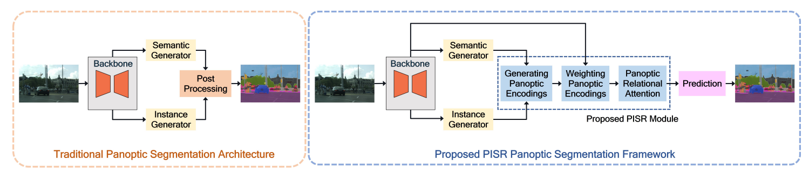
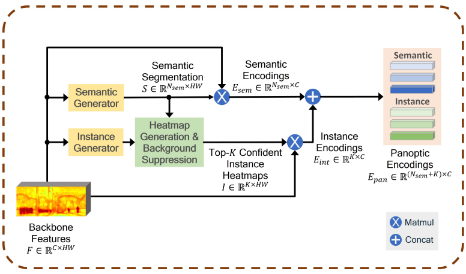
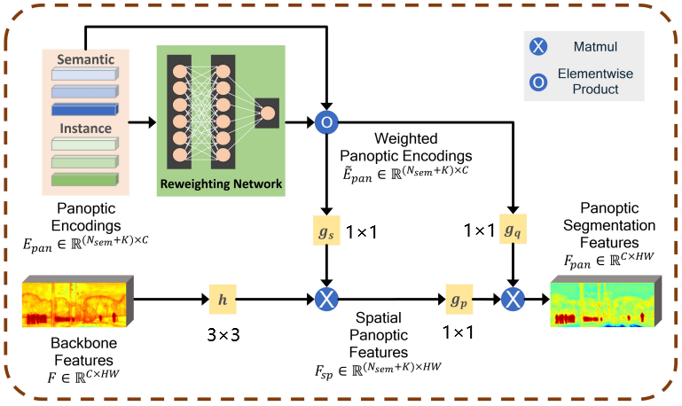

# Introduction
与很多研究全景分割的论文一样，本文同样认为过去的许多全景分割工作将语义分割和实例分割作为两个单独的模块运行，在后处理阶段才结合两者的输出得到最终的全景分割结果，这种方式不仅存在冗余计算，最终结果的准确性还很大程度上依赖于物体检测的质量。后续的一些改进虽然有所突破，但或多或少有些缺陷，于是本文提出了一个能够*捕获语义类与实例之间关系的*、*可以直接用在许多现有模块上提升它们的性能*的模块**PISR**(*Panoptic, Instance, and Semantic Relations*)。
## Function
给定一个图像，PISR会计算其中语义类以及关键实例的编码，在这个过程中它会自动确定哪些实例应该得到更多关注；PISR随后会将注意力机制运用到这些编码以及全局特征图上，以此来捕获对最终的全景分割结果有用的上下文关系。
# Applying PISR for Panoptic Segmentation

*传统全景分割模型  与  使用PISR的全景分割模型*
## Generating Initial Panoptic Encodings

### Heatmap Generation & Background Suppression
实例生成器会得到实例的*质心*(center mass)M与*中心偏移*(center offset)O，根据M与O我们可以确定置信度最高的K个实例中心并以此得到K个最初的**heatmap**；接着我们将从语义生成器得到的S以stuff与thing为根据进行二分类分割，并把结果同上一步得到的heatmap相乘来抑制背景。
## Reweighting Panoptic Encodings & Panoptic Relational Attention

### Reweighting Panoptic Encodings
尽管这个网络的结构十分简单，但它为PISR提供了一种关键的能力，使其对K更具鲁棒性。这是因为随着K增加，这种重新加权允许PISR生成较好的全景分割结果，而在没有加权的情况下分割结果可能会变差。
# Experiments