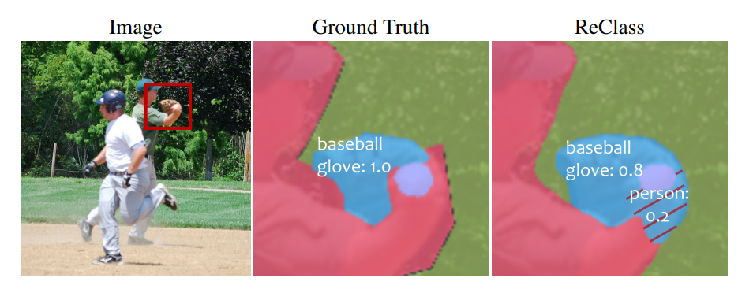

# Introduction
回顾最近主流的基于mask-transformer的全景分割网络，作者发现：这些架构通过使用**sigmoid交叉熵**损失来进行监督，尽管最终得到的假阳性(FP)损失与假阴性(FN)损失极度不平衡，但这种不平衡反而为最终的分割带来了更好的结果，这一策略虽有优势，但也会导致网络的收敛速度与稳定性降低。为了既保持sigmoid交叉熵损失带来的优势，又使得网络的训练更加稳定，本文于是提出了两个通过增加训练时间松弛度来自适应调节损失权重的策略：*Relaxation on Masks*(**ReMask**)与*Relaxation on Classes*(**ReClass**)。
## Motivation
ReMask的提出是基于语义分割比全景分割更加简单这一事实，粗粒度的语义分割结果可以指导全景分割的结果来减少假阳性错误；ReClass的提出是基于作者对预测掩码的观察：每个预测掩码可能包含涉及多个类的区域而在mask-transformer架构下的ground truth掩码却只应该包含一个目标，为了解释这一差异，他们用*软化的标签*(**softened label**)来代替原先的*one-hot class label*，新的标签允许ground truth标签同时属于多个类。
# Method
## ReMask

*p是在给定一个$query\in{R^{N_Q\times{d_q}}}$后，由一个掩码分类头(**mask classification head**)处理得到的分类结果；$\sigma(·)$是将logit标准化的sigmoid函数*
通过ReMask操作，$m_{pan}$中的假阳性错误会被$\sigma(m_{sem})\sigma(p^T)$抑制，这样在训练时每个relaxed query可以更快聚焦于相关的类。
## ReClass

*ReClass的运用场景*
根据预测的语义掩码与ground truth之间的重叠程度，为每个预测掩码的标签重新分配各个类的置信度。
# Conclusion
由ReMask与RaClass组成的ReMax给使用Mask-Transformer的全景分割带来了更好的训练结果，特别是在训练速度与最终表现上有着显著的影响。
# Limitations
由于所有的实验都是在TensorFlow上进行的，所以本文建立的baseline未能在其他环境中得到验证；除此之外，ReClass根据每个掩码的尺寸来计算它所属的各个类的权重，这可能也不够准确。