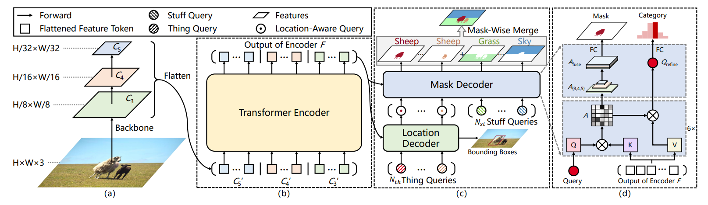
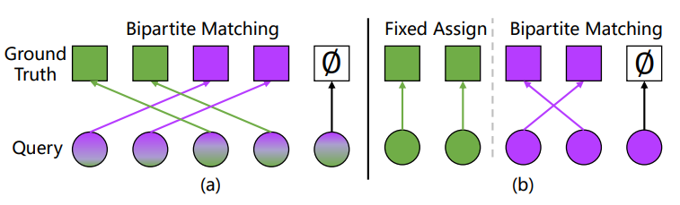

# Introduction
作者指出目前（2021年）很多全景分割领域的工作试图通过query集来使用**transformer**同时处理图片中的stuff与thing两类对象，其中之一的DETR就通过加入一个全景头的方式给出了一种简单的解决方案。尽管DETR操作简单，它也有着诸如收敛速度慢、处理得到的边界框保真度较低等问题。为了克服DETR的缺点，作者提出了一系列策略来改善它的性能，这些策略最终同DETR的原始架构一起组成了本文的**Panoptic SegFormer**。
## Innovative Point
1.    **高效的深度监督mask decoder**(*efficient deeply-supervised mask decoder*)：以分层的方式监督mask decoder的注意力模块，这可以让注意力模块快速关注有意义的区域，从而提升性能、节约时间。
2.    **query解耦策略**(*query decoupling strategy*)：将query集的职责进行解耦，避免stuff类与thing类的互相干扰。
3.    **改进的后处理方法**(*improved post-processing method*)： 同时考虑分类与分割质量来解决掩码冲突，该策略可以在不增加额外开销的情况下提升性能。
## Motivation
SegFormer的设计主要基于作者他们对DETR的观察：
+    在mask decoder中深度监督对*学习高质量的判别注意力表示*（**learning high-qualities discriminative attention representations**）有着很重要的作用；
+    由于stuff与thing类有着许多不同的性质，因此用相同的方法处理它们不太合适；
+    通常使用的后处理方法，例如逐像素确定argmax，在某些极端异常的影响下往往会产生假阳性（FP）错误。
# Architecture

## Transformer Encoder
与之前基于transformer的方法不同，SegFormer的Encoder采用了*可变形卷积注意力机制*（**deformable attention**）。由于可变形卷积注意力的计算复杂度较低，SegFormer的Encoder可以更好地处理高分辨率的特征图。
## Decoder
### Query Decoupling Strategy

简单来说，query解耦策略就是将query集拆分为thing类query与stuff类query两部分。对于thing类query，ground truth由二分匹配的方法确定；对于stuff类query，模型采用*固定类分配策略*（**class-fixed assign strategy**），每个query确定一整个stuff类。
## Inference Strategy
作者提出*掩码合并策略*（**Mask-Wise Merging Inference**），与以往逐像素确定argmax的方法不同，该方法根据掩码的置信度分数来确定重叠区域的归属。