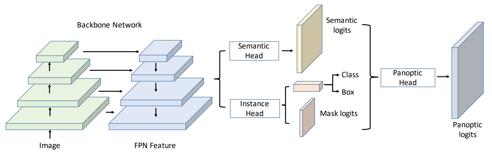
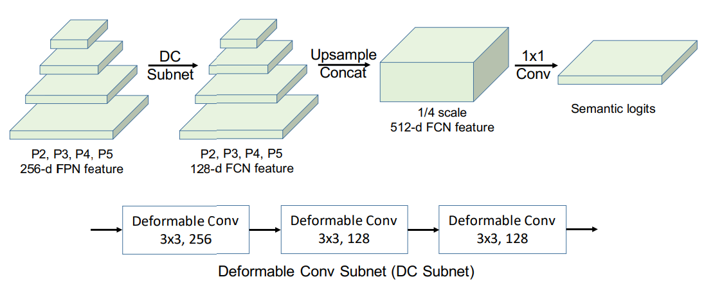
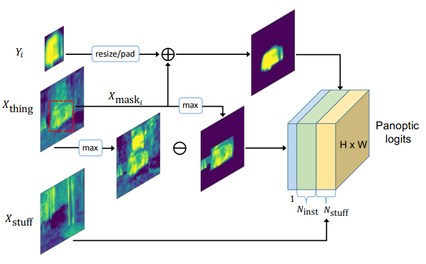

# Introduction
与诸多全景分割网络的作者的想法相同，本文的作者同样认为语义分割与实例分割不应该割裂开来，于是在简短地总结了[Kirillov](https://openaccess.thecvf.com/content_CVPR_2019/papers/Kirillov_Panoptic_Segmentation_CVPR_2019_paper.pdf)等人在全景分割定义上的贡献（即stuff、things的划分与它们和语义、实例分割任务的关系）后，本文作者提出了*统一的全景分割网络*(**Unified Panoptic Segmentation Network**)，简称UPSNet，来解决语义分割与实例分割的割裂问题。
与之前的全景分割网络单独为语义分割和实例分割提供两种独立的分支不同，UPSNet使用一个单独的网络作为backbone，在该网络之上又设计了两个head来同时解决两种分割问题： 
+ 语义头（semantic head）建立在*可变形卷积*（**deformablre convolution**）的基础上，并利用从*特征金字塔网络*（**feature pyramid networks**）中获取的多维信息；
+ 实例头（instance head）依照**Mask R-CNN**的设计输出掩码分割结果、边界框以及框内物体所属类。

semantic head与instance head的输出会被交付给最终的panoptic head，该head会进行预测并给出最终的全景分割结果。
# UPSNet Architecture

## Backbone
作者采用**Mask R-CNN**作为特征提取网络，该网络使用了*残差网络***ResNet**以及*特征金字塔网络***FPN**。
## Instance Segmentation Head
如上文所述，实例头依照Mask R-CNN的设计，输出边界框回归结果、分类结果以及掩码分割结果。该模块的目的是生成能够更好地识别things类的实例表示，供下一个模块即全景头使用。
## Semantic Segmentation Head

语义头会从FPN得到比例分别为原图像的$\frac{1}{4}、\frac{1}{8}、\frac{1}{16}$以及$\frac{1}{32}$的channel数均为256的特征图，这些特征图首先互不影响地通过一个相同的可变形卷积网络，随后处理过的特征图将统一上采样至$\frac{1}{4}$规格并拼接在一起形成新的特征图，接着会有单独的模块对这个新的特征图进行1×1卷积降维并使用softmax函数预测语义类。
在计算语义头的损失时，为了更着重强调图像中的前景物体，作者在损失函数中融入了**RoI损失**，在训练时他们结合实例的ground truth边界框切割1×1卷积后得到的特征图，并将切割下来的块（实例）的大小调整至28×28，最终对这些大小一致的实例计算交叉熵。
RoI损失的加入实际上对不正确分类的实例中的像素进行了更多的惩罚，这有助于在不损害语义分割结果的条件下提升全景分割的性能。
## Panoptic Segmentation Head
作者将来自语义头的结果记为X，X的channel大小、高和宽分别被记为($N_{stuff}+N_{thing}$)、H和W，依据channel的维度，X又可以被分为$X_{stuff}$与$X_{thing}$，分别对应stuff类与thing类的分割结果。
关于$N_{stuff}$和$N_{thing}$（后文作者用$N_{inst}$替代）的确定，作者指出$N_{stuff}$在不同图片中是一个固定值而$N_{inst}$根据情境有不同的确定方式——在训练时$N_{inst}$根据ground truth确定、在预测时$N_{inst}$则由mask剪枝过程得到。全景头的目的就是首先生成一个大小为($N_{stuff}+N_{inst}$) × H × W的tensor Z然后为每个像素确定它们的类和实例ID。
### Details of Panoptic Segmentation Head

首先将$X_{stuff}$赋值给Z的前$N_{stuff}$个channel来提供分类stuff的logit，接着从实例头那里拿到大小为28×28的掩码logit $Y_i$。除此之外，我们还能得到边界框$B_i$以及类ID $C_i$——在训练时它们由ground truth确定而在预测时它们由Mask R-CNN得到。
有了这些数据，我们可以通过从$X_{thing}$中与$C_i$对应的channel获取由$B_i$框定的的数据，进而实现从语义头$\mathbf{X_{mask_i}}$得到第i个实例的另一种表示形式，其中，$X_{mask_i}$的大小为H×W、它里面不属于边界框$B_i$的部分的数值为0。
随后我们通过双线性插值的方式将$Y_i$调整到与$X_{mask_i}$具有相同的$\textit{比例}$，并在边界框外用0填充得到与$X_{mask_i}$相同$\textit{大小}$的$\mathbf{Y_{mask_i}}$。

由此第i个实例的最终表示为
$$Z_{N_{stuff}+i}=X_{mask_i}+Y_{mask_i}$$

一旦我们根据所有实例的信息(来自语义头以及实例头)完成了Z的表示工作，我们就在Z的channel上预测每个像素的类别。需要注意的是，如果某个最大值落到前$N_{stuff}$个channel上，那么该像素属于stuff类；否则就根据最大值的所属情况将该像素划为某个实例，最大值所属的channel即为该实例的ID。
在预测时，只确定实例的ID是不够的，我们还需要确定它所属的类(stuff只需确定类而thing需要同时确定所属类以及实例ID)。